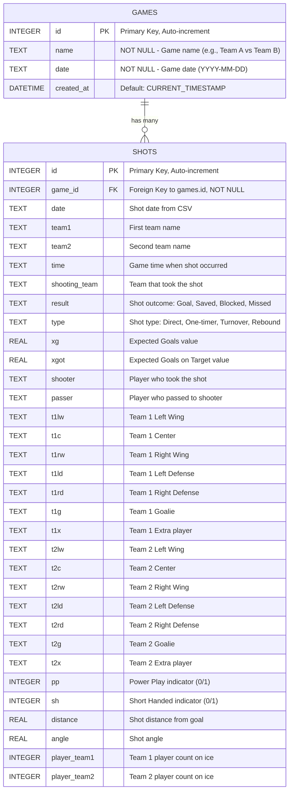

# Database UML Diagram

## Shot Data Import System - Database Schema

## Relationship Details

- **One-to-Many Relationship**: One game can have many shots
- **Foreign Key Constraint**: `shots.game_id` references `games.id`
- **Referential Integrity**: Each shot must belong to a valid game

## Current Database Status

- **Games Table**: 1 record
  - Game: "Kloten-Dietlikon Jets vs Floorball Uri" (2025-09-14)
- **Shots Table**: 110 records
  - All shots belong to game_id = 1

## Key Features

1. **Unique Identifiers**: Each table has auto-incrementing primary keys
2. **Data Integrity**: Foreign key relationship ensures shots belong to valid games
3. **Comprehensive Shot Data**: Tracks player positions, shot metrics, and game state
4. **Flexible Design**: Can accommodate multiple games and their respective shots
5. **Temporal Tracking**: Games have creation timestamp for audit purposes

## Data Types

- **INTEGER**: Used for IDs, counts, and boolean flags (0/1)
- **TEXT**: Used for names, descriptions, and categorical data
- **REAL**: Used for numerical measurements (distances, angles, probabilities)
- **DATETIME**: Used for timestamps with automatic current time default

## Constraints

- **Primary Keys**: Auto-incrementing unique identifiers
- **NOT NULL**: Required fields (game name, date, game_id for shots)
- **Foreign Key**: Maintains referential integrity between games and shots
- **Default Values**: Automatic timestamp creation for games